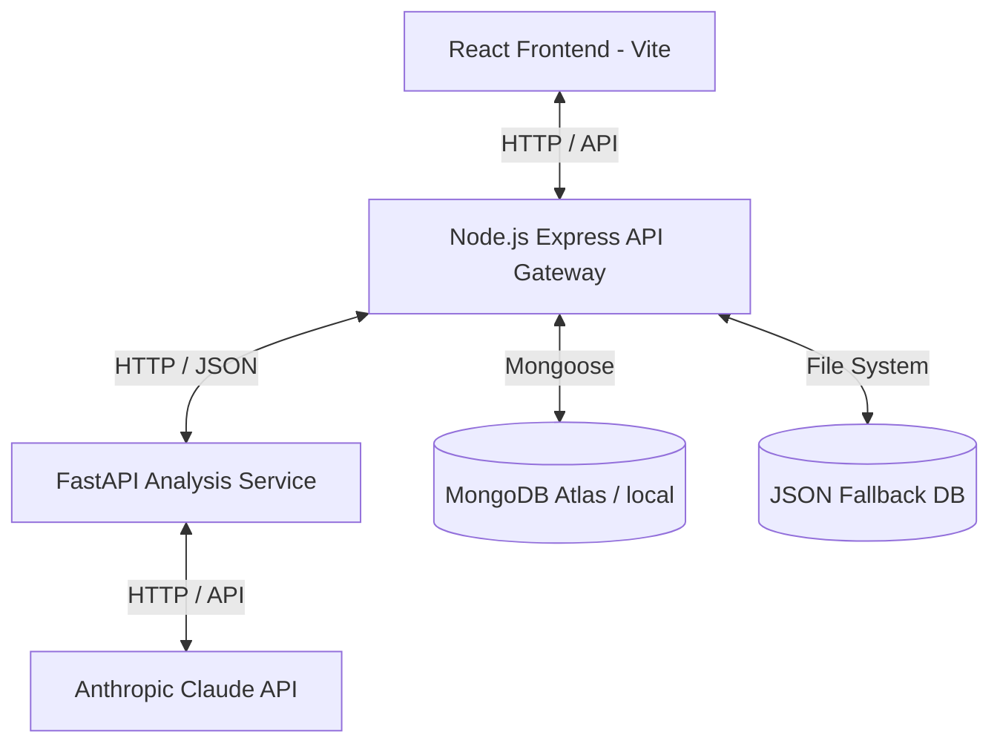

# Architecture Design - AI Resume Analyzer Bot

This document outlines the architecture, components, and communication flow of the AI Resume Analyzer Bot.

## Overview

The application is structured as a multi-tier microservice architecture:
1. **Frontend (React/Vite)**: Users interact with a dark-themed responsive dashboard, upload resumes, configure target roles, and view analytical insights.
2. **API Backend (Node.js/Express)**: Serves as the gateway, manages CORS, handles file uploads, manages sessions/history caching, and proxies heavy analysis requests to the Python AI service.
3. **AI Service (Python/FastAPI)**: Performs computationally heavy tasks: text parsing (PDF, DOC, DOCX, TXT), rule-based scoring, and qualitative LLM evaluation.

## Service Communication & Ports

| Service | Protocol | Default Port | Primary Responsibilities |
|---|---|---|---|
| **Frontend** | HTTP | `5173` (Dev) | Dashboard UI, Charts, Interactive Recommendations, Upload Dropzone |
| **API Backend** | HTTP | `5000` | Multer Upload, MongoDB Connection/JSON fallback, Session & History API |
| **AI Service** | HTTP | `8000` | Text Parsing, Keyword Matching, Scorer, Claude Integration |

## Database Integration Strategy

To keep the installation friction-free while supporting persistent histories:
1. **Mongoose/MongoDB**: Used if a valid `MONGODB_URI` is specified in `backend-node/.env`.
2. **JSON DB Fallback**: If MongoDB connection fails or is omitted, the backend falls back to standard JSON file-based database store in `backend-node/data/history.json`.

## AI Service Flow

1. **Parser Layer**: Checks mime-type and extension. Routes to custom parser (`pdfplumber` for PDF, `docx_parser` for DOCX, plain read for TXT).
2. **Analysis Layer**:
   - Rules engine counts keywords, computes length, checks formatting, checks for standard sections (Summary, Experience, Projects, Skills, Education).
   - Tailors keywords to "Target Job Role" (e.g. Frontend developer looks for React, CSS, JS; Data scientist looks for Python, SQL, ML).
3. **LLM Layer**: Sends the parsed text + target role to Claude using a JSON-response prompt. Claude evaluates qualitative points (strengths, weaknesses, suggestions).
4. **Scoring Engine**: Merges rule-based score (contact details, length, sections) and LLM quality score to return a final rating out of 100.
